# Hidden Gems

## Table of Contents
1. [UX](#ux)
    - [Project Goals](#project-goals)
    - [User Stories](#user-stories)
    - [Development Planes](#development-planes)
        - [Strategy Plane](#strategy-plane)
        - [Scope Plane](#scope-plane)
        - [Structure Plane](#structure-plane)
        - [Skeleton Plane](#skeleton-plane)
        - [Surface Plane](#surface-plane)
2. [Business Model](#business-model)
    - [SEO](#seo)
    - [Marketing](#marketing)
3. [Features](#features)
    - [Site Features](#site-features)
    - [Features Left to Implement](#features-left-to-implement)
4. [Testing](#testing)
5. [Deployment](#deployment)
    - [Prerequisites](#prerequisites)
    - [Heroku Deployment](#heroku-deployment)
    - [Forking the Project](#forking-the-project)
    - [Cloning the Project](#cloning-the-project)
    - [AWS Bucket Creation](aws-bucket-creation)
    - [Stripe Configuration](stripe-configuration)
6. [Technologies Used](#technologies-used)
    - [Technologies](#technologies)
    - [Python Modules Used](#python-modules-used)
    - [External Python Modules](#external-python-modules)
7. [Credits](#credits)

## UX
### Project Goals
The main aim of this project is to allow users to buy affordable jewellery from this online boutique jewellery store. Users can purchase items anonymously (without signing in and creating an account) or buy creating an account first, with added benefits for those who create an account, such as having the ability to save their delivery details, create wishlists and leave reviews.
### User Stories
User stories for this project were broken down into the following epics:

EPIC: Navigating through the website
- As a shopper, I want to be greeted with a clearly structured interface, so that I can navigate through the website with ease
- As a shopper, I want the website to be responsive, so that I can access it on a range of devices
- As a shopper, I want to view a list of products, so that I can browse the store to know what to buy
- As a shopper, I want to view details about an individual product, so that I can see the product description, price, image, reviews, and be able to purchase the item
- As a shopper, I want to see how many items have been added to my basket, so that I can be aware of what I have selected

EPIC: Registration and User Accounts
- As a new user, I want to navigate to the sign up page, so that I can create an account
- As a registered user, I want to login to my account, so that I can make purchases
- As a registered user, I want to log out of my account, so that I can protect my information from being accessed by others
- As a registered user, I want to be able to edit my account details, so that I can make changes if needed
- As a registered user, I want to have a personalised user profile, so that I can view my account details and any previous purchases I have made
- As a new user, I want to receive an email confirmation after signing up, so that I can confirm that my account is set up successfully

EPIC: Sorting and searching for products
- As a shopper, I want to sort the list of available products, so that I can easily view the items alphabetically or by price
- As a shopper, I want to sort items by category, so that I can view just the items I am interested in buying
- As a shopper, I want to search for a product, so that I can find exactly what I am looking for
- As a shopper, I want to view what I have searched for and the number of items I have searched for, so that I can see whether the product I want is available

EPIC: Purchasing and checkout
- As a shopper, I want to be able to add an item to my basket and choose how many of an item I want to buy, so that I can select the quantity I desire in case I want more than one of the item
- As a shopper, I want to view the items in my basket, so that I can see what items I have chosen and the total cost
- As a shopper, I want to adjust the quantity of an item from the checkout page, so that I can easily edit my purchase before the checkout
- As a shopper, I want to be able to remove an item from my basket, if I no longer want it
- As a shopper, I want to receive feedback when adding, editing or deleting a product, so that I can clearly see what I have done
- As a shopper, I want to view any delivery costs on the checkout page, so that I can see how much I am paying for delivery and if I'd rather purchase something extra to avoid this cost
- As a registered user, I want to see my delivery details automatically filled in on the checkout page, so that I can save time when it comes to checking out
- As a shopper, I want to receive an email confirmation after completing my payment, so that I can see exactly what I have purchased and the cost for future records
- As a shopper, I want to be able to put in my card details, so that I can make a purchase

EPIC: Reviewing products
- As a registered user, I want to be able to review a product, so that I can give feedback
- As a shopper, I want to be able to see reviews for the products, so that I can see which are rated highly
- As a registered user, I want to be able to edit my reviews, so that I can make adjustments if needed
- As a registered user, I want to be able to delete my reviews, if I no longer want to leave that review

EPIC: Adding items to a wishlist
- As a registered user, I want to be able to add a product that I like to a wishlist, so that I can save the item without having to add it to the checkout
- As a registered user, I want to be able to view my favourited items in my wishlist, so that I can see all of the items that I like before I buy them

EPIC: Contacting the store
- As a shopper, I want to be able to contact Hidden Gems directly, so that I can let them know about any queries I have

EPIC: Frequently asked questions
- *As a shopper, I want to see a list of FAQs, so that I can see common queries that other people have - **could have***
- *As a registered user, I want to be able to submit a question on the FAQ page, so that I can enquire about any general concerns - **could have***

EPIC: Administrative managing of the store
- As a store owner, I want to be able to add new products to the store, so that I can update the items we sell
- As a store owner, I want to be able to edit items, so that I can update the price/description/image
- As a store owner, I want to be able to delete items, so that I can remove items that are no longer on sale

### Development Planes
#### Strategy Plan
The Strategy Plane deals with who this site is built for and addresses their goals and needs.

The webiste will focus on the following target audiences:
- **Roles:**
    - Individuals wanting to purchase jewellery
    - New customers (non-registered)
    - Returning customers (registered)
- **Demographics:**
    - Passion for jewellery
    - Those wanting to buy a gift for someone
    - Those wanting to buy jewellery for themselves
    - Upscale but not expensive so accessible to most people
- **Psychographics:**
    - Personality & Attitudes:
        - Interest in jewellery
        - Desire to purchase a unique, well made item
        - Keen to support a growing new business that focuses on quality over mass production
    - Values:
        - Thoughtful
        - Elegant
        - Good taste
    - Lifestyles:
        - Fashionable
        - Ability to buy nice pieces of jewellery but not targeting just wealthy individuals
        - Likes to treat themselves or treat others to a thoughtful, unique gift

The website needs to enable the **user** to:
    - Register/login to account
    - View the different items of jewellery by searching or using the categories provided
    - Purchase an item of jewellery
    - Edit/delete the items in their shopping bag
    - Edit/delete their delivery information
    - View their current and past orders
    - Get in contact
    - Leave reviews on products
    - Add items to a wishlist
    - Subscribe for newsletters/offers

The website needs to enable the **client** to:
- Login to admin account
- Edit and update items on the website
- Provide informative information about each item (description, image, size)
- Provide a way for users to get in contact
- Have the ability to delete any reviews if they are inappropriate

#### Scope Plane
The Scope Plane details what needs to be included in the site to correspond with the strategised features listed above.

**Content Requirements:**
- The user will be looking for:
    - Informative and detailed product information:
        - Name
        - Description
        - Image
        - Price
        - Materials
        - Any reviews
    - Easy to navigate website
    - Aesthetic theme (colour palette, typography, images)
    - Contact information
    - Ability to login/register
    - Ability to view their shopping bag
    - Ability to view their current and past orders
    - Ability to leave reviews
    - Ability to add items to a wishlist
    - Ability to subscribe to a newsletter

**Functionality Requirements:**
- The user will be able to:
    - Access the website on a range of devices (from 320px upwards)
    - Search for items by:
        - Typing into the search bar
        - Browsing through the categories provided
    - Ability to make purchases, view them in their shopping bag, and edit or delete items in their bag
    - Register/login to account
    - Get in contact
    - Favourite items to add to a wishlist
    - Subscribe to a newsletter
    - Add reviews for products

#### Structure Plane
The Structure Plane demonstrates how the information on the site will be structured.
- The following flowchart illustrates the information architecture for an unregistered user navigating the site:

- The following flowchart illustrates the information architecture for a registered user navigating the site:

- The following flowchart illustrates the information architecture for an admin member adding, editing and deleting products:

#### Skeleton Plane
The Skeleton Plane shows what the site will look like. Balsamic wireframes have been used to demonstrate this.

Home page

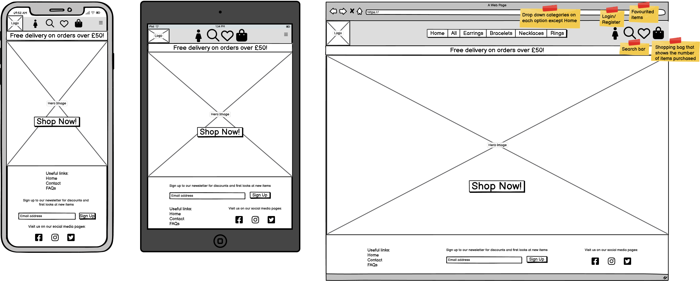

View Products page

Product Detail page

Search Products page

Login page

Sign Up page

Shopping Bag page

Checkout page

Profile page

Leave a Review page

Wishlist page

Contact Us page

FAQs page

 

- **Database Design**

An Entity Relationship Diagram has been created with Lucidchart to show the various models created for this website and how they are connected.
- The two principle models used throughout this site are the User Profile model and the Products model as they connect to almost all of the other models through primary/foreign key relationships.
- The User Profile model uses Django All-Auth to create personalised user profile areas and is used whenever a user signs in to use the site.
    - The User Profile model allows connects to the order model, the wishlist model and the reviews model to allow signed in users to save their delivery details in their profiles (through the Order model), add items to their personal wishlist (through the Wishlist model), and add and edit reviews (through the Reviews model).
- The Product Model is used for the creation of products on the site and is connected to the Wishlist model, so that users can add a specific product to their wishlist, the Order Line Item model, so that users can place orders for specific products, and the Reviews model, so that users can leave reviews for specific products.
- The Category model is used within the Product model to determine which category a product is in.
- The Contact model and the FAQ model are two stand alone models that do not have foreign keys to any other models as a user does not need to be a signed in user to use these features.

#### Surface Plane
The Surface Plane demonstrates what the site will look like in greater depth by focusing on the finer details, such as the colour scheme and typography.

- **Colour Scheme**

The colour scheme for this project is as follows:

It is based on a pastel pink and purple colour scheme and has been chosen because they are gentle welcoming colours that correspond with the imagery associated with a jewellery store.

This colour contrast grid shows how these colours could be paired together to ensure there are no contrast issues.

- **Typography**

    - The font used for the headings on the site is 'Courgette'. This font was chosen because its slight italic and cursive design complements the logo font and adds to the delicate nature of a jewellery store.
    - The font 'Quattrocento Sans' is used as the main font because it is clear to read and goes well with the headings font.
    - These two fonts were paired together using Fontjoy.

- **Imagery**
    - The logo was created through Shopify's online logo maker.
    - The hero image and the product images were all sourced from the free image sites 'Unsplash' and 'Pexels'.

## Business Model
### SEO
### Marketing
#### Social Media Marketing
- A Facebook page has been created for Hidden Gems to enable the store to benefit from organic social media marketing.
- The profile picture is the logo for the site and the cover photo is the hero image.
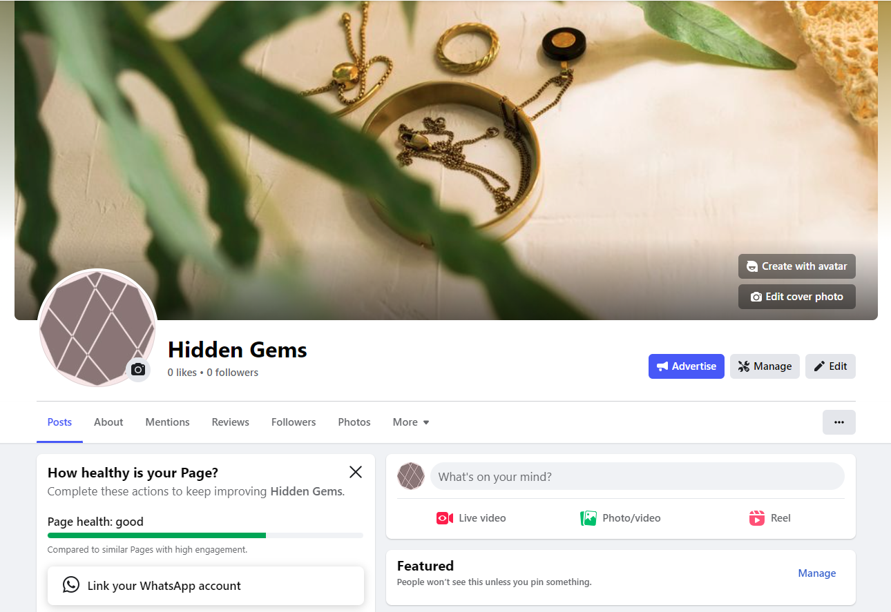
- The intro section gives some information about Hidden Gems, such as their website, email address and location. As it is an online store it will always be open.
- There are also a couple of posts to encourage people to take a look at the store.
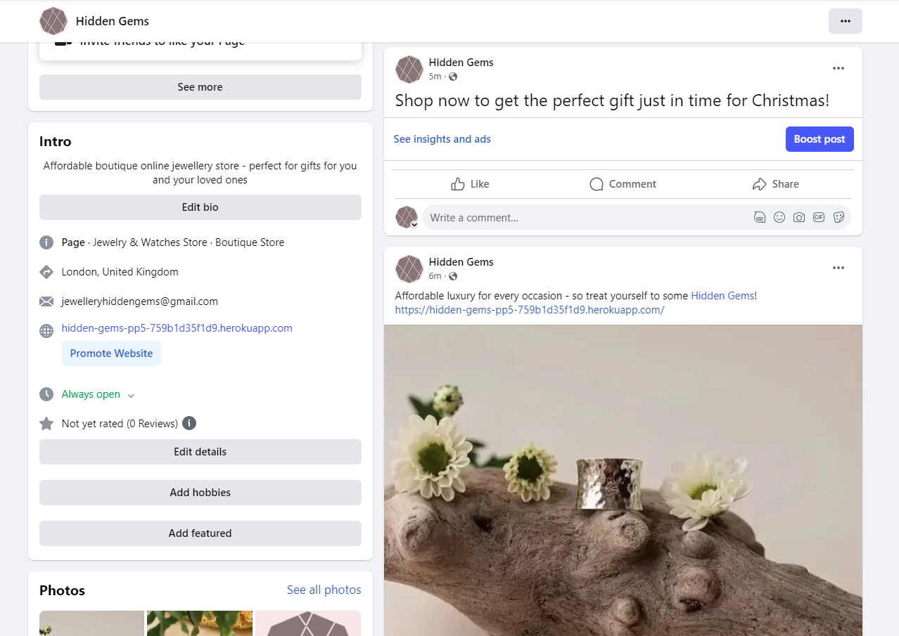
- At the end of the page you can see some photos that have been added as well as the profile picture for the site.
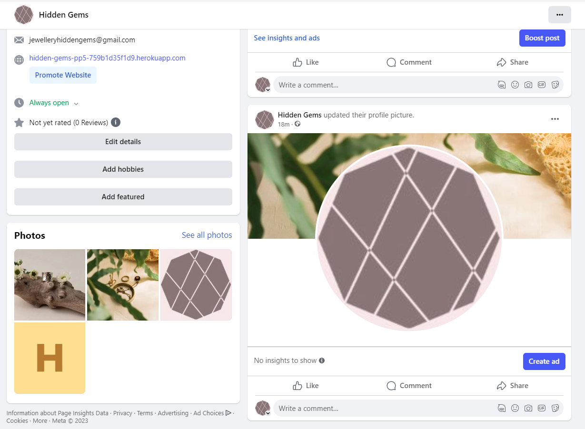

#### Email Marketing
- In the footer of the website there is a sign up form for users to input their email address to sign up to the Hidden Gems newsletter.
- This is a form of email marketing as it allows Hidden Gems to directly promote themselves via users' emails.

## Features
### Site Features
***Header***
- Both the header and footer will be shown on every page of the website, regardless of whether the user is registered or not. 
- The below headers show what a general unregistered or non-logged in user will see, whereas a signed in user will see their profile username next to the character icon.

Desktop header

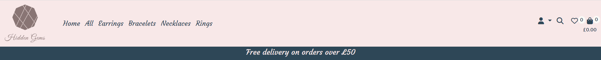

Mobile header

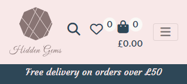

***Footer***

***Home Page***
- The home page has a simple design to draw users towards the 'Shop now' button which will take users to the products page.

Desktop home page

Mobile home page

***Products***
- The products page shows all of the products for sale on the site.
- Users can sort the items by name, price or category or they can search for products.
- The total number of products displayed will be shown and there is a back to top button at the bottom of the page to take the user to the top of the page.
- On each product card the user can see the product name, image, the price, the category and they can also add the item to their wishlist by clicking on the heart icon.
- If the user is not logged in, clicking the heart icon will take them to the login page, but if they are logged in, clicking this button will add the item to their wishlist.

Desktop products page

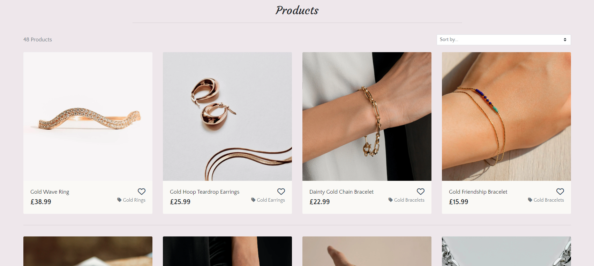

Mobile products page

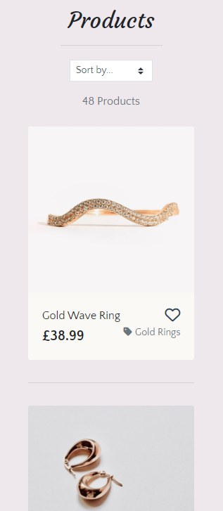

***Product Details***
- The product detail page shows some further information about the product, including its description and the materials it is made from.
- It also enables users to choose the quantity of the product that they would like to purchase (the user can only choose a quantity between 1 and 99, as the plus and minus buttons will become disabled outside of this range - as seen in the screenshot - and they will be presented with an error message to only select a value within this range).
- The user can also add the item to their wishlist from this page.
- The user has the option to continue shopping or to add the item to their bag.

Desktop product details page

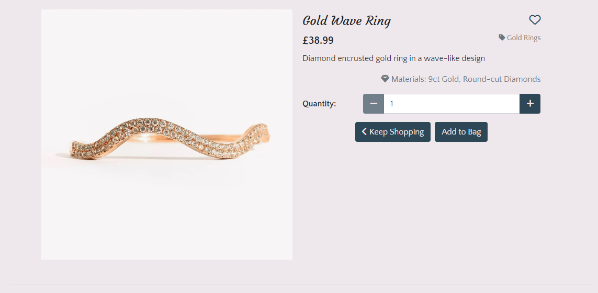

Mobile product details page

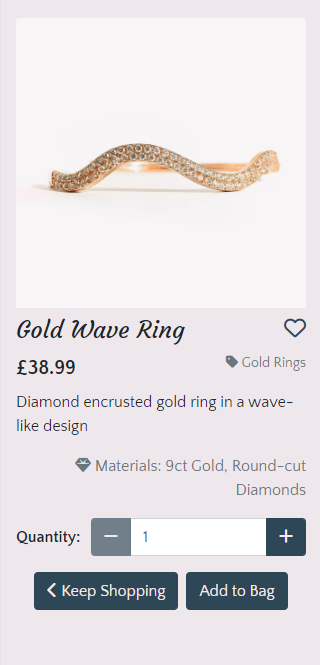

- Once the user has added an item to their bag they will be presented with a success message and the option to go straight to the checkout page.
- This message will also inform the user of how much more they could spend to get free delivery.
- Furthermore, once an item is added to the user's basket, the icon in the header will increment and the total price will be displayed below.

Desktop basket success message

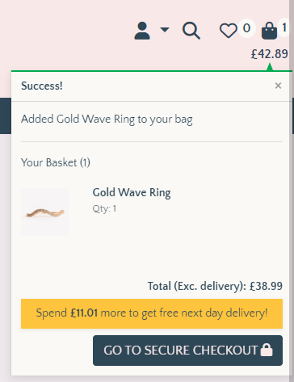

Mobile basket success message

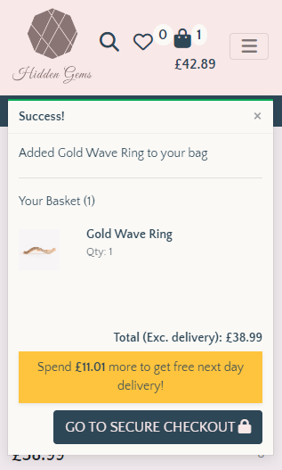

***Reviews***
- For general users, clicking on the reviews accordion will reveal any reviews that have been left for a particular product.
- If there are no reviews, there will be a message informing the user that there are currently no reviews, but they can login to leave one.
- If the user is not signed in, there will be a link at the bottom to the login page so that users can login and then they will be redirected back to the reviews page to leave their review.
- The review shows the user's profile name, the date they posted their review, and the content of their review.

Desktop reviews (non-signed in users)

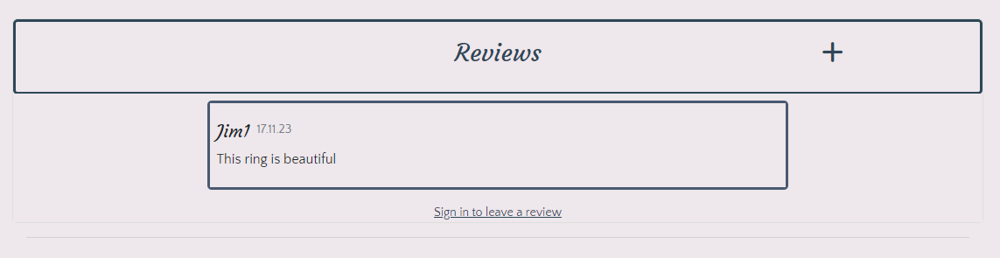

Mobile reviews (non-signed in users)

- For users who are signed in, they will be able to click the 'Leave a review' button to leave their review.
- Also if the signed in user is the one who wrote the review, they will be able to edit or delete their review. This will only be available to the author of the review so that no other users can edit another user's review.
- However, admin members will be presented with these buttons for all reviews so that they have the power to remove a review if it is inappropriate in any way.

Desktop reviews (signed in users)

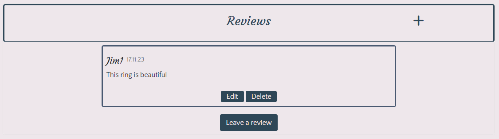

Mobile reviews (signed in users)

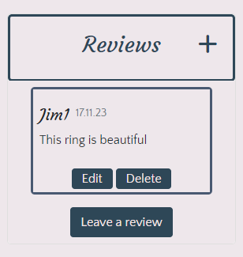

- When users click the 'Leave a review' button, a modal will pop up allowing users to write their review.
- Clicking the 'Submit' button will post the user's review in the reviews section.

Desktop review modal

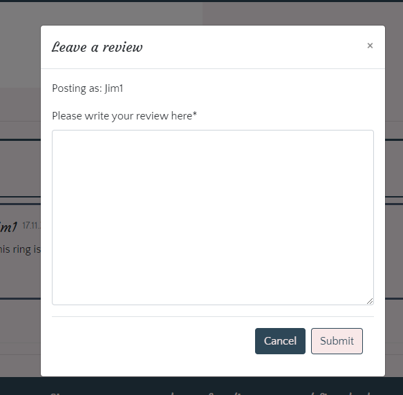

Mobile review modal

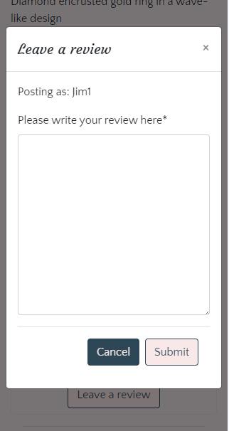

***Basket***
- The basket page show all of the items that the user has chosen to purchase.
- It also gives them the opportunity to update their basket or to remove an item from their basket.
- It shows how much the items cost and how much delivery will cost.
- It also provides a message to the user informing them of how much more they could spend to get free delivery.
- Finally, there are buttons for the user to continue shopping or to head to the checkout page.

Desktop basket

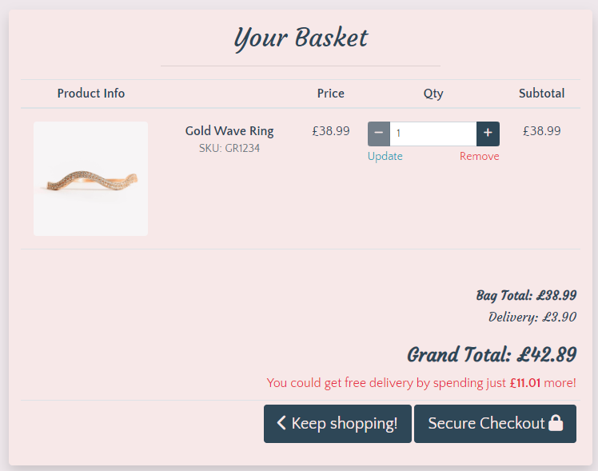

Mobile basket

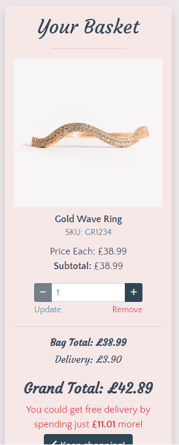

***Checkout***
- The checkout page is where the user fills out all of their details, including their personal details, their delivery details and their payment details.
- It also shows the user their order summary again.
- On the mobile checkout page, the user will be presented with their order summary before they have to fill out their details.

Desktop checkout page

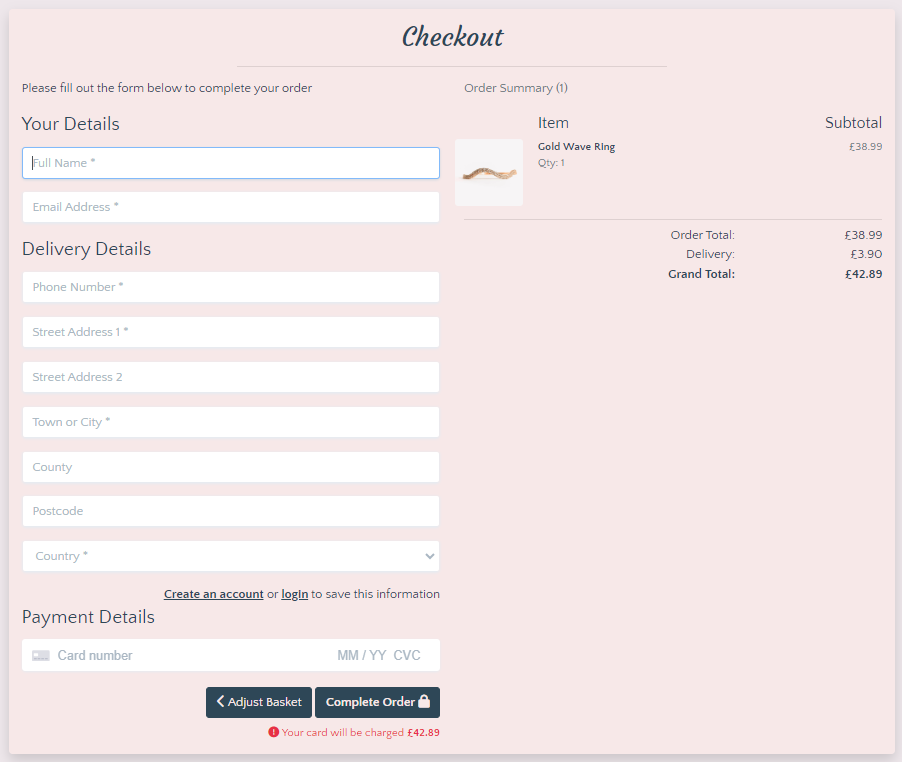

Mobile checkout page

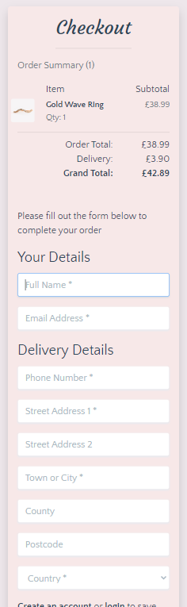

- Once the user has placed their order, they will be shown a success message and will be taken to the order confirmation page where they can see a summary of their order.
- Their order summary will also be emailed to them.

Desktop confirmation

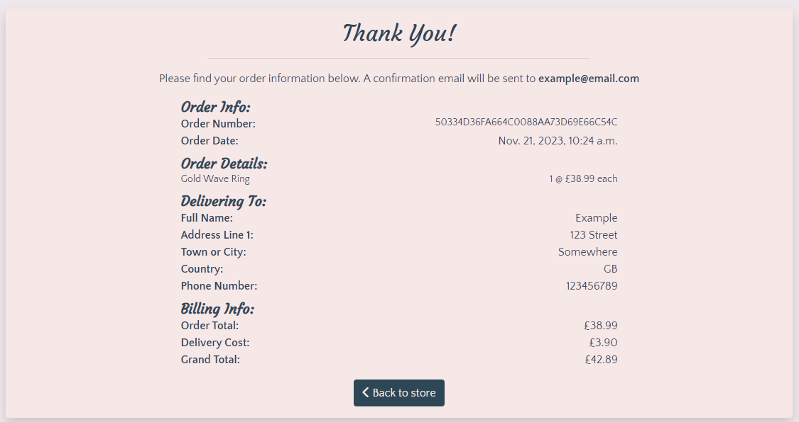

Mobile confirmation

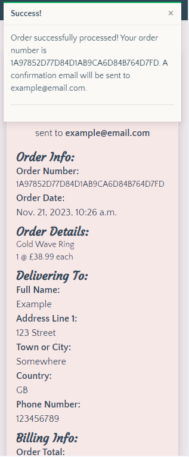

***Wishlist***
- Signed in users can access their wishlist by clicking on the heart icon in the header.
- If a user is not signed in, clicking this button will take them to the login page.
- In the wishlist page, users can see all of the items they have added, they can click on them to show the product details, and they can remove items from their wishlist by clicking on the heart icon again.

Desktop wishlist

Mobile wishlist

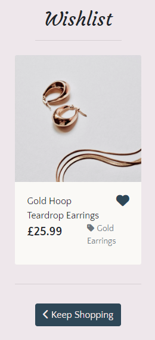

***Contact Us***
- In the footer there is a link for the user to contact the Hidden Gems team.
- Clicking this link will open up a form for the user to fill in where they can send an email directly to Hidden Gems.
- Users do not need to be signed in to do this, so they are required to enter their full name and email address.
- Once they submit their form, the user will receive a confirmation email showing what they had posted.

Desktop contact us

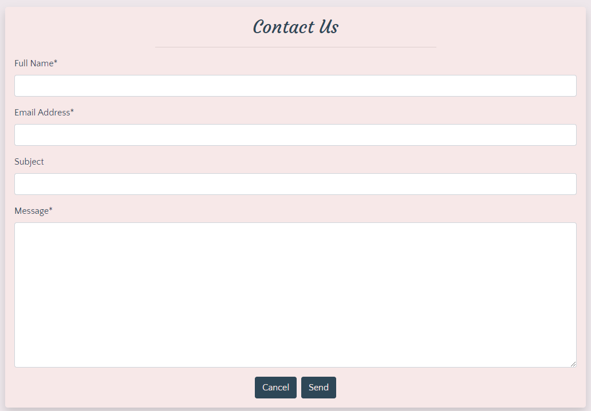

Mobile contact us

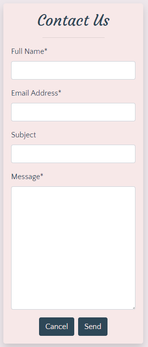

### Features Left to Implement
- I would like to implement a FAQ section which would display as an accordion, so when a user clicks on a question the answer will pop out below. I think this will add an extra layer of functionality to users, but the reason I did not add this feature in at the moment is because I thought a Contact Us section was more of a priority than the FAQ section, and because of time constraints I was able to implement both.
## Testing
## Deployment
### Prerequisites
### Heroku Deployment
### Forking the Project
### Cloning the Project
### AWS Bucket Creation
### Stripe Configuration
## Technologies Used
### Technologies
### Python Modules Used
### External Python Modules
## Credits
